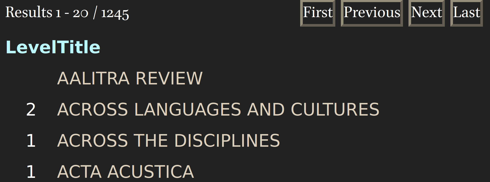

```{r, include=FALSE}
knitr::opts_chunk$set(echo = FALSE, warning = FALSE, message = FALSE, dev='cairo_pdf', fig.align='center', fig.show='hold')
# setwd("/home/agricolamz/work/materials/2023.10.04_MIPT_linguistic_bibliometrics")
library(tidyverse)
library(tidytext)
library(stopwords)
library(kableExtra)
theme_set(theme_minimal()+theme(text = element_text(size = 16), legend.position = "bottom"))
```

#  Введение

##  [@gonzalez23] ландшафт биомедицинских исследований

> The number of publications in biomedicine and life sciences has rapidly grown over the last decades, with over 1.5 million papers now published every year. This makes it difficult to keep track of new scientific works and to have an overview of the evolution of the field as a whole. Here we present a 2D atlas of the entire corpus of biomedical literature, and argue that it provides a unique and useful overview of the life sciences research. <...>

<https://static.nomic.ai/pubmed.html> (интерактивная версия)

**Это препринт!**

##  [@gonzalez23]

```{r, out.width='65%'}
knitr::include_graphics("images/01_landscape.png")
```

2D эмбеддинги на основе 21 миллиона аннотаций, которые были траснформированы в 768-мерное векторное пространство при помощи PubMedBERT [@gu21], а дальше сплюснутая в 2D при помощи t-SNE [@maaten08]. Цвета основаны на названиях журналов.

##  [@gonzalez23]

```{r, out.width='49%'}
knitr::include_graphics("images/02_landscape_by_year.png")
knitr::include_graphics("images/03_covid.png")
```

Регион карты, посвященный Covid-19. Цвета приписаны на основе названий работ. Кроме того здесь есть около 15% работ не посвященных короновирусу.

##  [@gonzalez23]

```{r, out.width='43%'}
knitr::include_graphics("images/04_landscape_by_gender.png")
knitr::include_graphics("images/05_education_surgery.png")
```

Статьи раскрашены по полу первого автора.

## Карта репозиториев гитхаба (Андрей Кашча)

```{r, out.width='75%'}

```

<https://anvaka.github.io/map-of-github/>
  

## Карта репозиториев гитхаба (Андрей Кашча)

```{r, out.width='78%'}
knitr::include_graphics("images/07_github_2.png")
```

<https://anvaka.github.io/map-of-github/>

## Библиометрические исследования

Библиометрия -- дисциплина, возникшая в конце XIX века, в рамках которой можно встретить разные применения математических методов к исследованию научных работ. Наиболее известные применения:

- графы соавторства
- библиографические ссылки 
- ключевые слова
- измерение качества журналов
- и др.

# Наш проект

##  Команда

- руководитель
    - Г. Мороз
- студенты
    - А. Агроскина (б)
    - А. Алексеева (б)
    - Т. Дедов (б)
    - А. Орехов (м)    
    - К. Сидоров (м)
    - А. Степанова (б)

##  План исследования

- выбрать список журналов для анализа
- извлечь аннотации для всех работ из выбранных журналов
- использовать векторизатор и метод уменьшения размерностей для преобразования пространства аннотаций в 2D
- исследовать, насколько релевантно для лингвистики получившееся пространство 
- выявить и исследовать возможные междисциплинарные стыки

# Сбор данных

## Списки журналов

Мы использовали несколько источников журналов

- Тэг `филология, лингвистика, медиакоммуникации` в вышкинском списке журналов

```{r, out.width='70%'}

```

- Тэг `6162 Languages` в списке журналов из ресурса [Finish Publication Forum](https://www.tsv.fi/julkaisufoorumi/haku.php)

```{r, out.width='45%'}

```

## Списки журналов

```{r, include=FALSE}
journals <- read_csv("/home/agricolamz/work/bureaucracy/linguistic_convergency/journals/abcd_list_annotated.csv")
```

После соединения списков журналов мы по своему усмотрению разметили их по некоторым категориям (теги: `linguistics` (`r journals |> filter(linguistics == "linguistics") |> nrow()`), `interdisciplinary` (`r journals |> filter(linguistics == "interdisciplinary") |> nrow()`), `language_learning` (`r journals |> filter(linguistics == "language_learning") |> nrow()`) и другие).

```{r}
journals |> 
  filter(linguistics == "linguistics") |>
  count(hse_level, helsenki_level)  |> 
  na.omit() |> 
  pivot_wider(names_from = helsenki_level, values_from = n, values_fill = 0)  |> 
  rename(`HSE level` = hse_level) |> 
  kable() |> 
  add_header_above(c(" " = 1, "Helsenki level" = 3)) |> 
  kable_styling(position = "center")
```

\pause

Разметка "лингвистичности" журналов --- огромная и слабо автоматизируемая работа, которая требует экспертизы в самых разных областях лингвистики.

## Сбор аннотаций лингвистических исследований

>- Мы планировали написать краулер, который бы собирал статьи из желаемых журналов...
>- но мы обнаружили базу данных `Crossref` и соответствующий пакет для R `rcrossref` [@chamberlain22]...
>- а потом мы обнаружили базу данных `OpenAlex` и соответствующий пакет для R `openalexR` [@aria23]

## Чистка аннотаций

>- заметки редактора
>- некрологи и поздравления
>- описания конференций
>- списки содержания книг
>- списки содержания выпусков журнала
>- аннотации отмененных (retracted) статей 
>- аннотации на отличном от английского языках
>- аннотации на нескольких языках
>- сообщения об отсутствии аннотации
>- acknowledgments вместо аннотации
>- библиографическое описание книги (в случаях рецензии)
>- начало статьи вместо аннотации (характерно для старых статей)
>- ошибки распознавания
>- слишком короткие/длинные аннотации

## Примеры проблемных аннотаций

```{r, out.width='100%'}

```

## Примеры проблемных аннотаций

```{r, out.width='100%'}

```

<https://doi.org/10.2307/486818>

# Результаты

```{r}
database <- read_csv("/home/agricolamz/work/bureaucracy/linguistic_convergency/journals/umap/2023-10-02.csv")

database |> 
  filter(field == "linguistics") |> 
  nrow() ->
  n_linguistic_abstracts
```

## Структура данных: `r n_linguistic_abstracts` строчек, `r ncol(database)` колонок

- `id`: https://openalex.org/W3040611730
- `doi`: https://doi.org/10.1075/fol.18056.dob
- `author`: Nina Dobrushina 
- `title`: Negation in complement clauses of fear-verbs 
- `publication_year`: 2021
- `journal`: Functions of Language
- `issn_l`: 0929-998X
- `first_page`: 121
- `last_page`: 152 
- `volume`: 28 
- `issue`: 2
- `is_retracted`: FALSE
- `cited_by_count`: 1
- `abstract`: \tiny Complement clauses of verbs of fear often contain expletive negation, which is negative marking without negative meaning. <...> \normalsize
- `concepts`: \tiny Negation; Complement (music); Linguistics; Verb; Meaning (existential); Psychology; Mathematics; Computer science; Philosophy; Biochemistry; Chemistry; Complementation; Psychotherapist; Gene; Phenotype \normalsize
- `retrieved`: 30-04-2023

## Векторное представление слов

- мы использовали векторизатор `doc2vec` [@le14; @wijffels21] (смотрели GloVe [@pennington14], думаем в сторону BERT [@devlin18] и RoBERTa [@liu19])
- полученное 50-мерное пространство мы сократили до 2D при помощи t-SNE  [@maaten08]

## Ландшафт лингвистических исследований

```{r, out.width='100%'}
database |> 
  filter(field == "linguistics") ->
  just_linguistics
  
just_linguistics  |> 
  ggplot(aes(umap_v1, umap_v2))+
  geom_point(size = 0.1, alpha = 0.2)+
  theme_void()
```

## Аннотации журналов, в названиях которых содержится *phon*  

```{r, out.width='95%'}
just_linguistics |> 
  filter(str_detect(journal_issn, "PHON")) |>
  ggplot(aes(umap_v1, umap_v2))+
  geom_point(size = 0.1, alpha = 0.2, color = "grey80",
             data = just_linguistics) +  
  geom_point(size = 0.2, alpha = 0.5) +
  theme_void()

just_linguistics |> 
  filter(str_detect(journal_issn, "PHON")) |> 
  distinct(journal_issn) |> 
  pull(journal_issn) ->
  journals
```

\tiny `r journals`

## Аннотации журналов, в названиях которых содержится *psych*  

```{r, out.width='95%'}
just_linguistics |> 
  filter(str_detect(journal_issn, "PSYCH")) |>
  ggplot(aes(umap_v1, umap_v2))+
  geom_point(size = 0.1, alpha = 0.2, color = "grey80",
             data = just_linguistics) +  
  geom_point(size = 0.2, alpha = 0.5) +
  theme_void()

just_linguistics |> 
  filter(str_detect(journal_issn, "PSYCH")) |> 
  distinct(journal_issn) |> 
  pull(journal_issn) ->
  journals
```

\tiny `r journals`

## Наша полуавтоматическая разметка аннотаций   

```{r, out.width='100%'}
abstract_annotation <- read_csv("/home/agricolamz/work/bureaucracy/linguistic_convergency/journals/first_results/annotated.csv")

just_linguistics |>
  left_join(abstract_annotation) |> 
  group_by(type) |> 
  summarize(umap_v1_mean = mean(umap_v1),
            umap_v2_mean = mean(umap_v2)) ->
  labels

just_linguistics |> 
  left_join(abstract_annotation) |> 
  filter(!is.na(type)) |> 
  ggplot(aes(umap_v1, umap_v2, color = type))+
  geom_point(size = 0.1, alpha = 0.2, color = "grey80",
             data = just_linguistics) +  
  geom_point(size = 0.2, alpha = 0.5) +
  geom_label(aes(umap_v1_mean, umap_v2_mean, label = type), data = labels, color = "black", alpha = 0.5)+
  theme_void()+
  theme(legend.position = "none")
```

## А что если добавить других дисциплин?

\scriptsize

```{r}
database |> 
  filter(field != "linguistics") |> 
  count(field, journal) |> 
  kable()
```

## А что если добавить других дисциплин?

```{r, out.width='100%'}
database |>
  group_by(field) |> 
  summarize(umap_v1_mean = mean(umap_v1),
            umap_v2_mean = mean(umap_v2)) ->
  labels

database |>
  ggplot(aes(umap_v1, umap_v2, color = field))+
  geom_point(size = 0.1, alpha = 0.2) +
  geom_label(aes(umap_v1_mean, umap_v2_mean, label = field), data = labels, color = "black")+
  theme_void()+
  theme(legend.position = "none")
```

# Заключение

## Заключение

>- Наши методы позволяют смотреть на предметную область с высоты птичьего полета
>- Наши методы позволяют искать места стыка и области междисциплинарных исследований
>- Необходимо продолжить исследование полученного пространства
>- Разметка журналов нуждается в дополнительной проверке
>- Необходимо доразметить аннотации
>- Интересно посмотреть другие векторизаторы (BERT, RoBERTa)
>- Интересно сравнить разные методы уменьшения размерности (t-SNE vs UMAP)
>- Не стоит обобщать знания, полученные на основе журнальных публикаций на всю область
>- Не все области гуманитарного и социального знания одинаково представлены в журнальных публикациях


## {}

\LARGE Спасибо за внимание!

# Литература {.allowframebreaks}